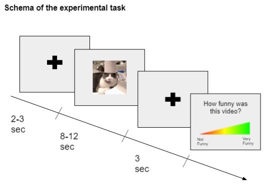

# Behavioral Task used to collect data

**Experiment:** In this experiment, people were asked to watch and rated (likert scales: arousal, pleasantness, funniness) a series of videos (neutral, funny and very funny) while their facial expressions were recorded.  

**Pseudo-Randomized Presentation:** Videos are in a pseudo-randomized order to ensure that video of the same type can't be shown more than three times in a row. The experiment is divided into 3 blocks of 50 videos and each block contains the same amount of neutral, funny and very funny videos. 

**Data:** For each video seen by the participant, we save in a CSV the name of the video and the rating on three scales, as well as different timestamps to compute response time. 

**Videos:**
- Humorous videos can be found at : https://youtube.com/playlist?list=PLcBTyKtg-JVDx9nAnzD8lnmIvXfH9avnL
- Videos' name were changed locally to add the type (1=neutral, 2=funny, 3=VeryFunny) at the begging. of the name. 
