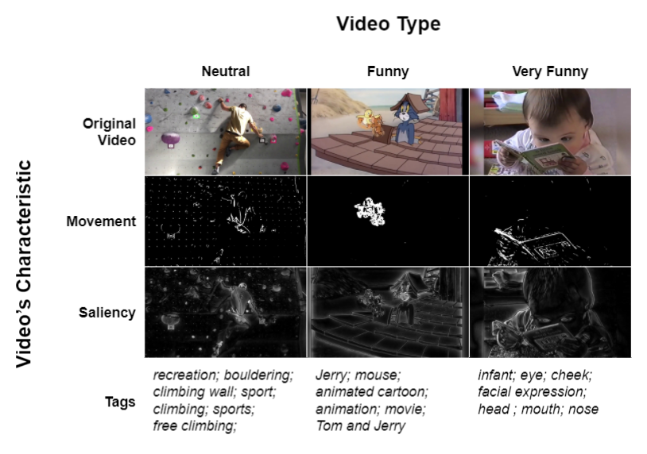

# Video features & properties

For this project, we wanted to use characteristics of neutral and humorous video to predict the perceived funninness. We used visual and semantic data.

**Visual properties**
- Movement (OpenCV)
- Saliency (OpenCV)

**Semantic metrics**
- Tags Creation by [Google Video Intelligence](https://cloud.google.com/video-intelligence)
- Normalized Google Distance
- Semantic Distance (WordNet / NLTK) 

